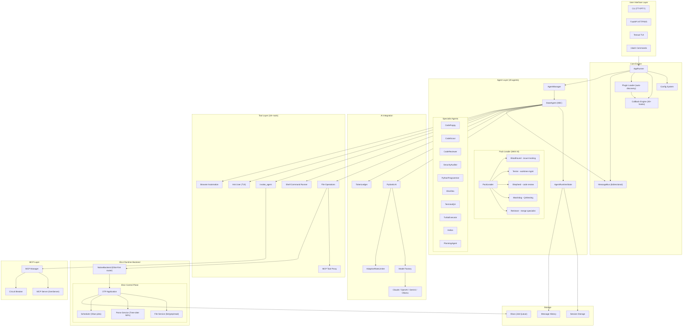
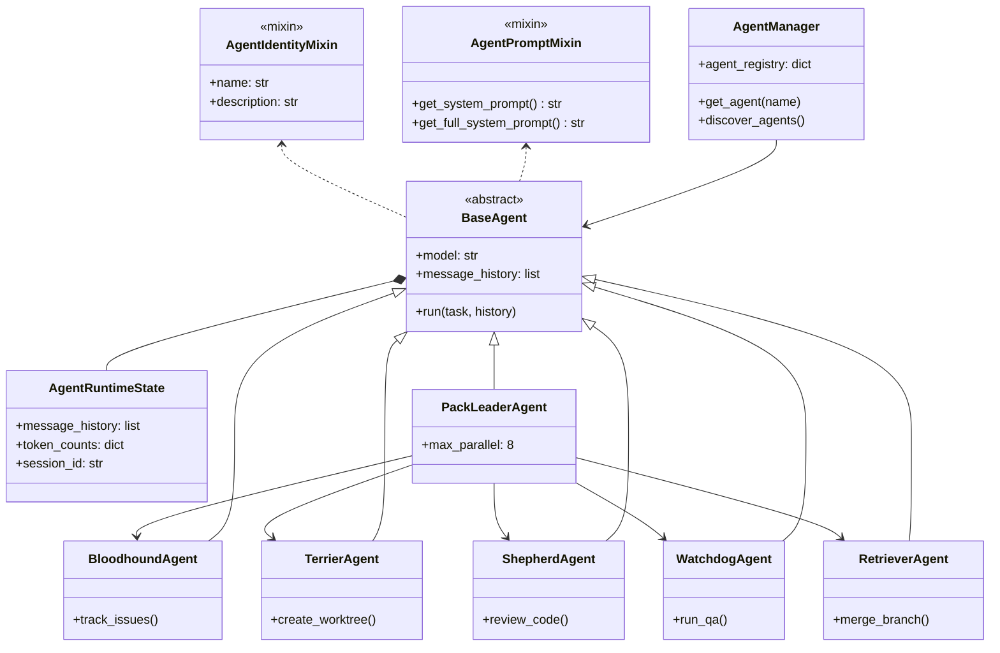
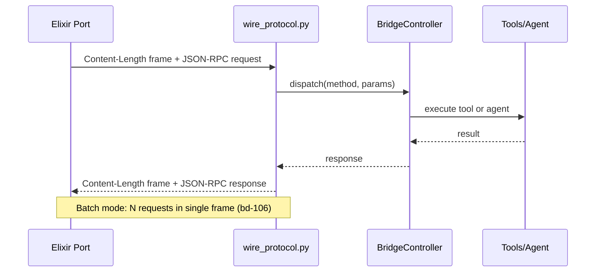
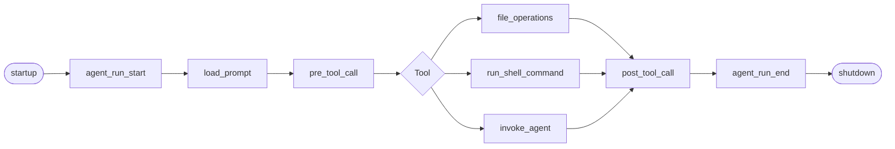
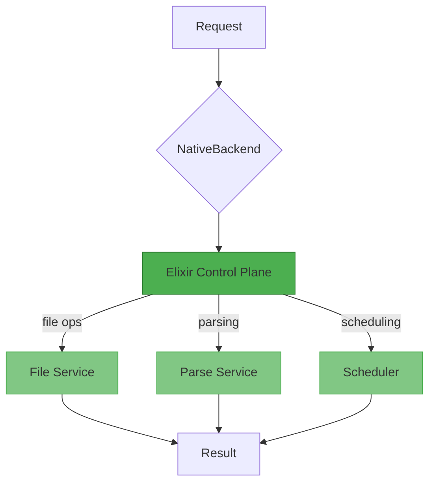
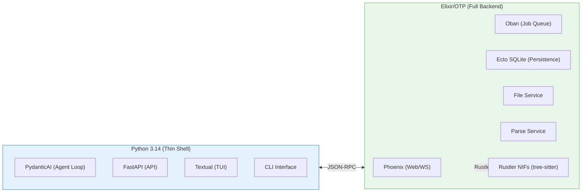

# Code Puppy Architecture (Mermaid)

> **Updated:** 2026-04-18 — Phase 4: Elixir-first native acceleration
> **Stack:** Python 3.14 (TUI/CLI/agent loop) + Elixir/OTP (ALL backend operations)
> **Architecture:** Fast Puppy runtime backend selector with Elixir-first routing

---

## 1. System Architecture Overview




---

## 2. Class Hierarchy — Agent System



---

## 3. Elixir Supervision Tree

```mermaid
flowchart TB
    App["CodePuppyControl.Application"]
    App --> Repo["Repo (Ecto SQLite)"]
    App --> PubSub["Phoenix.PubSub"]
    App --> EventStore["EventStore (ETS)"]
    App --> RunReg["Run.Registry"]
    App --> RunSup["Run.Supervisor"]
    App --> PWSup["PythonWorker.Supervisor"]
    App --> MCPReg["Registry (MCP)"]
    App --> MCPSup["MCP.Supervisor"]
    App --> ConcSup["Concurrency.Supervisor"]
    App --> ReqTracker["RequestTracker"]
    App --> Oban["Oban (SQLite Lite)"]
    App --> Cron["CronScheduler"]
    App --> Endpoint["Web.Endpoint (Phoenix)"]
```




---

## 4. Communication: Python to Elixir (JSON-RPC 2.0)



---

## 5. Callback Hook Lifecycle



---

## 6. Native Backend Routing



---

## 7. Technology Stack



---

## 8. Repository Structure

```
code_puppy/
├── code_puppy/                 # Python thin shell (TUI + CLI + agent loop)
│   ├── agents/                 # 28 agent classes
│   │   ├── base_agent.py       # BaseAgent ABC
│   │   ├── agent_manager.py    # Discovery + registry
│   │   ├── agent_pack_leader.py
│   │   └── pack/               # Bloodhound, Terrier, etc.
│   ├── plugins/                # 40+ plugins
│   │   ├── elixir_bridge/      # Python-Elixir JSON-RPC bridge
│   │   ├── fast_puppy/         # Runtime backend selector (Python)
│   │   └── pack_parallelism/   # Run limiter
│   ├── tools/                  # 18+ tools (routed to Elixir)
│   ├── messaging/              # MessageBus + renderers
│   ├── native_backend.py       # Elixir-first backend router
│   ├── callbacks.py            # Hook engine
│   └── config.py
├── elixir/code_puppy_control/  # Elixir OTP application (FULL BACKEND)
│   ├── lib/                    # OTP app, protocol, file_ops, scheduler
│   └── native/                 # Rust NIFs (tree-sitter bindings)
├── tests/                      # Python test suite
├── pyproject.toml              # Python build
└── lefthook.yml                # Git hooks
```
