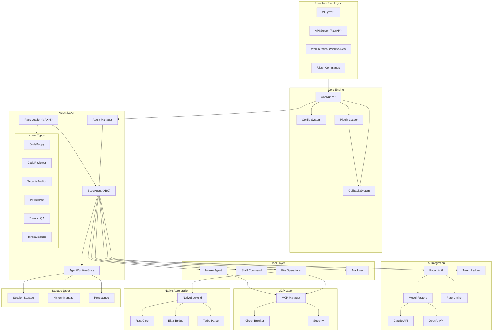
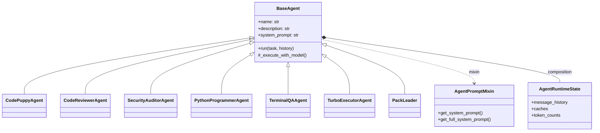
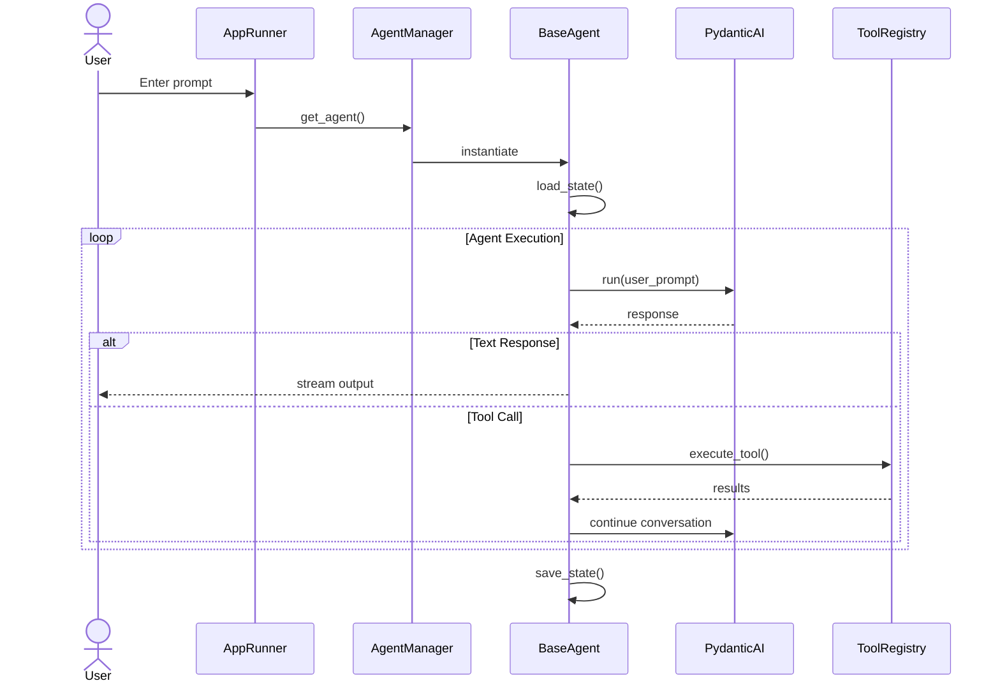
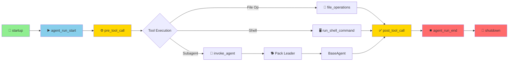
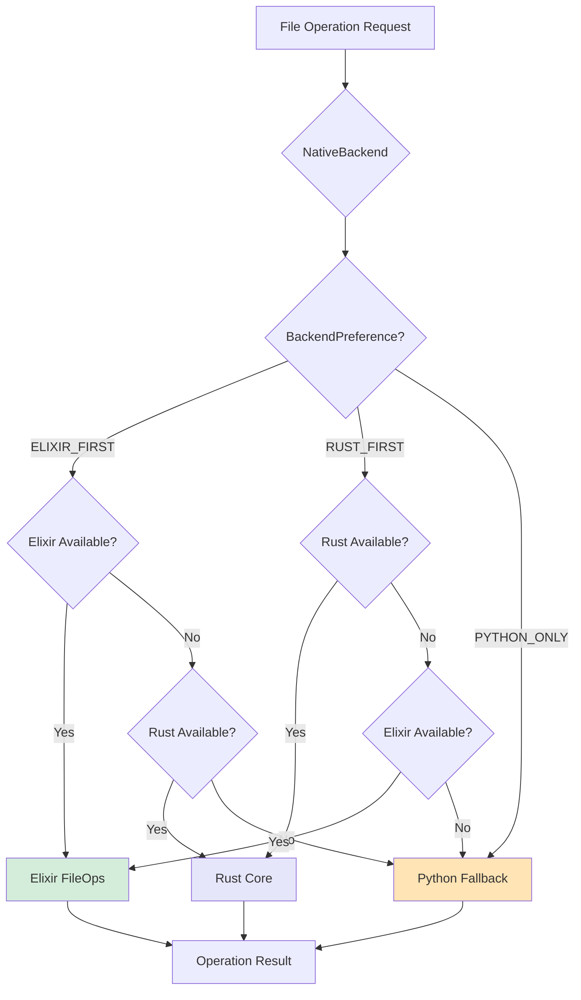

# Code Puppy Architecture (Mermaid)

## System Architecture Diagram

```mermaid
flowchart TB
    subgraph UI["User Interface Layer"]
        CLI["CLI (TTY)"]
        API["API Server (FastAPI)"]
        Web["Web Terminal (WebSocket)"]
        Slash["/slash Commands"]
    end

    subgraph Core["Core Engine"]
        App["AppRunner"]
        Config["Config System"]
        Callbacks["Callback System"]
        Plugins["Plugin Loader"]
    end

    subgraph Agents["Agent Layer"]
        AgMgr["Agent Manager"]
        Base["BaseAgent (ABC)"]
        State["AgentRuntimeState"]
        Pack["Pack Leader (MAX=8)"]
        
        subgraph Types["Agent Types"]
            CP["CodePuppy"]
            CR["CodeReviewer"]
            SA["SecurityAuditor"]
            PP["PythonPro"]
            TQA["TerminalQA"]
            TE["TurboExecutor"]
        end
    end

    subgraph AI["AI Integration"]
        PAI["PydanticAI"]
        ModelFact["Model Factory"]
        Rate["Rate Limiter"]
        Tokens["Token Ledger"]
        Claude["Claude API"]
        OAI["OpenAI API"]
    end

    subgraph Tools["Tool Layer"]
        FileOps["File Operations"]
        Shell["Shell Command"]
        Invoke["Invoke Agent"]
        Ask["Ask User"]
    end

    subgraph Native["Native Acceleration"]
        Backend["NativeBackend"]
        Rust["Rust Core"]
        Elixir["Elixir Bridge"]
        Parse["Turbo Parse"]
    end

    subgraph MCP["MCP Layer"]
        MCPMgr["MCP Manager"]
        Circuit["Circuit Breaker"]
        MCPSec["Security"]
    end

    subgraph Storage["Storage Layer"]
        Sess["Session Storage"]
        Hist["History Manager"]
        Persist["Persistence"]
    end

    UI --> App
    App --> Config
    App --> Callbacks
    App --> Plugins
    Plugins --> Callbacks
    
    App --> AgMgr
    AgMgr --> Base
    Base --> State
    Base --> PAI
    
    Pack --> Base
    Pack --> Types
    
    PAI --> ModelFact
    PAI --> Rate
    Base --> Tokens
    ModelFact --> Claude
    ModelFact --> OAI
    
    Base --> FileOps
    Base --> Shell
    Base --> Invoke
    Base --> Ask
    
    FileOps --> Backend
    Backend --> Rust
    Backend --> Elixir
    Backend --> Parse
    
    FileOps --> MCPMgr
    Invoke --> MCPMgr
    MCPMgr --> Circuit
    MCPMgr --> MCPSec
    
    State --> Sess
    State --> Hist
    State --> Persist
```

## Class Hierarchy

```mermaid
classDiagram
    class BaseAgent {
        +name: str
        +description: str
        +system_prompt: str
        +run(task, history)
        #_execute_with_model()
    }
    
    class AgentPromptMixin {
        +get_system_prompt()
        +get_full_system_prompt()
    }
    
    class AgentRuntimeState {
        +message_history
        +caches
        +token_counts
    }
    
    class CodePuppyAgent
    class CodeReviewerAgent
    class SecurityAuditorAgent
    class PythonProgrammerAgent
    class TerminalQAAgent
    class TurboExecutorAgent
    class PackLeader
    
    BaseAgent <|-- CodePuppyAgent
    BaseAgent <|-- CodeReviewerAgent
    BaseAgent <|-- SecurityAuditorAgent
    BaseAgent <|-- PythonProgrammerAgent
    BaseAgent <|-- TerminalQAAgent
    BaseAgent <|-- TurboExecutorAgent
    BaseAgent <|-- PackLeader
    
    BaseAgent ..> AgentPromptMixin : mixin
    BaseAgent *-- AgentRuntimeState : composition
```

## Data Flow Sequence

```mermaid
sequenceDiagram
    actor User
    participant App as AppRunner
    participant AgMgr as AgentManager
    participant Base as BaseAgent
    participant PAI as PydanticAI
    participant Tools as ToolRegistry
    
    User->>App: Enter prompt
    App->>AgMgr: get_agent()
    AgMgr->>Base: instantiate
    Base->>Base: load_state()
    
    loop Agent Execution
        Base->>PAI: run(user_prompt)
        PAI-->>Base: response
        
        alt Text Response
            Base-->>User: stream output
        else Tool Call
            Base->>Tools: execute_tool()
            Tools-->>Base: results
            Base->>PAI: continue conversation
        end
    end
    
    Base->>Base: save_state()
```

## Plugin Hook Flow

```mermaid
flowchart LR
    Startup["🚀 startup"] --> RunStart["▶️ agent_run_start"]
    RunStart --> PreTool["⚙️ pre_tool_call"]
    PreTool --> ToolExec{"Tool Execution"}
    
    ToolExec -->|File Op| File["📁 file_operations"]
    ToolExec -->|Shell| Shell["🖥️ run_shell_command"]
    ToolExec -->|Subagent| Invoke["👥 invoke_agent"]
    
    File --> PostTool["✅ post_tool_call"]
    Shell --> PostTool
    Invoke --> Pack["🐕 Pack Leader"]
    Pack --> Sub["BaseAgent"]
    Sub --> PostTool
    
    PostTool --> RunEnd["⏹️ agent_run_end"]
    RunEnd --> Shutdown["🛑 shutdown"]
    
    style Startup fill:#90EE90
    style RunStart fill:#87CEEB
    style PreTool fill:#FFD700
    style PostTool fill:#FFD700
    style RunEnd fill:#FF6B6B
    style Shutdown fill:#FF6B6B
```

## Native Backend Decision Tree

```mermaid
flowchart TD
    FileOp["File Operation Request"] --> Backend{"NativeBackend"}
    
    Backend --> Pref{"BackendPreference?"}
    
    Pref -->|ELIXIR_FIRST| ElixirAvail{"Elixir Available?"}
    Pref -->|RUST_FIRST| RustAvail{"Rust Available?"}
    Pref -->|PYTHON_ONLY| Python["Python Fallback"]
    
    ElixirAvail -->|Yes| Elixir["Elixir FileOps"]
    ElixirAvail -->|No| RustFromEl{"Rust Available?"}
    RustFromEl -->|Yes| Rust["Rust Core"]
    RustFromEl -->|No| Python
    
    RustAvail -->|Yes| Rust
    RustAvail -->|No| ElixirFromRust{"Elixir Available?"}
    ElixirFromRust -->|Yes| Elixir
    ElixirFromRust -->|No| Python
    
    Elixir --> Result["Operation Result"]
    Rust --> Result
    Python --> Result
    
    style Python fill:#FFE4B5
    style Rust fill:#E6E6FA
    style Elixir fill:#D4EDDA
```
